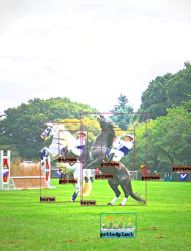
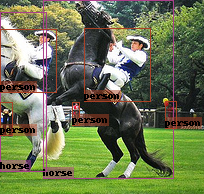
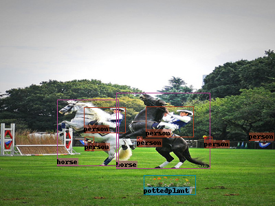

# changeable

基于pytorch的目标检测数据增强工具包。

**VOC格式数据集** ->  **transforms**  ->  **无限dotaloader**  ->  **mosaic数据增强**  ->  **anchors匹配**  =>  **输出** : tuple(image[B, C, H, W], boxes[B, num_anchors * num_classes, 4], labels[B, num_anchors*num_classes], image_name[B])

|                                                              |                                                              |
| ------------------------------------------------------------ | ------------------------------------------------------------ |
|  |  |


# Documentation

## dataloader

定义了类似于torch.data.Dataloader的 dataloader。

实现的功能：

- 无限采样。（训练流程更好控制）

- mosaic图片生成。

  实现过程，采用先裁剪，后合成mosaic图片的方式。较直接覆盖，变化更加丰富。

  可先对单张图片进行数据增强，然后合成mosaic图片，使用更加方便。

- anchor分配。（将boxes与label，和anchors对齐，对于不同目标数量的图片，boxes格式均相同，方便批次处理）

```python
def dataloader(dataset, batch_size=1, resize: Tuple[int, int]=None, anchors_assigner=None, shuffle=True, num_workers=0,  use_mosaic=False):
    """
    数据加载器。
    通过指定的anchor分配器，将
    可指定使用mosaic数据增强，将四张图组合成mosaic图片。

    :param dataset:             数据集，torch.data.dataset，输出为(image:ndarry, boxes:ndarry, labels:ndarry, id:str)
    :param batch_size:          批次
    :param resize:              归一化后的尺寸(使用mosaic时，mosaic图片尺寸；不使用mosaic时，resize填充灰边，保持宽高比)
    :param anchors_assigner:    anchor分配器, AnchorsAssigner,
    :param shuffle:             是否打乱数据集
    :param num_workers:         线程数
    :param use_mosaic:          是否使用mosaic数据增强
    :return:                    提供anchor分配器:
                                    images: [B, C, W, H], boxes: [B, num_anchors, 4], labels: [B, num_anchors],
                                不提供anchor分配器:
                                    images: [1, C, W, H], boxes: [1, num_object, 4], labels: [1, num_object],

    """
```

## mosaic

在合成mosaic时，读入四张图片。先随机生成图片交汇点；然后计算各位置图片所需尺寸；对四张图片分别进行尺寸裁剪，并去除中心在裁剪区域外的标注框；合并生成mosaic图片。

mosaic图片生成，在dataloader中进行，因而可以在合成前，通过dataset中transforms对单张图片进行数据增强。

|                        |                                          |                                          |                                          |                                          |
| :--------------------: | :--------------------------------------: | :--------------------------------------: | :--------------------------------------: | :--------------------------------------: |
|         mosaic         |                 |                 |                 |                 |
| mosaic with trasnforms |  |  |  |  |

## AnchorsAssigner （anchors分配）

**每个标注框都最少含有一个与之最接近的anchor**。

```python
class AnchorsAssignerIOU(AnchorsAssigner):
    def __init__(self, anchors: AnchorsGenerator, threshold: float=0.6): 
        # 按照iou阈值分配anchors。参数分别为Anchors、iou阈值（iou大于该阈值为匹配成功）。
    def __call__(self, gt_boxes: Union[ndarray, Tensor], gt_labels: Union[ndarray, Tensor]):
		# 标注框与标签。标注框格式'xyxy'
```

```python
class AnchorsAssignerWH(AnchorsAssigner):
    def __init__(self, anchors: AnchorsGenerator, threshold: float=3):
        # 按照宽高比分配anchors。参数分别为Anchors、宽高比阈值（宽高比小于该阈值为匹配成功）。
    def __call__(self, gt_boxes: Union[ndarray, Tensor], gt_labels: Union[ndarray, Tensor]):
		# 标注框与标签。标注框格式'xyxy'
```

|                     |                                    |                                    |                                    |
| :-----------------: | :--------------------------------: | :--------------------------------: | :--------------------------------: |
|  按IOU分配anchors   |  |  |  |
| AnchorsAssignerIOU  |           threshold=0.5            |           threshold=0.5            |           threshold=0.5            |
| 按宽高比分配anchors |    |    |    |
|  AnchorsAssignerWH  |            threshold=3             |            threshold=3             |            threshold=3             |

## AnchorsGenerator (anchors生成)

```python
class AnchorsGenerator(object):
    def __init__(self, 
                 image_size: Tuple[int, int],  # 输入图片尺寸
                 feature_maps_size: Tuple[Tuple[int, int], ...],   # 多层特征图尺寸
                 anchors_size: Tuple[Tuple[Tuple[float, float], ...], ...],  # 每层特征图上anchor尺寸
                 form: str='xyxy',  # xyxy or cxcywh
                 clip: bool=True):  # 超出图片anchor是否截断
                 
```

```python
eg:
        anchors = AnchorsGenerator(image_size=(300, 300),
                               feature_maps_size=((76, 76), (38, 38), (19, 19)),
                               anchors_size=(((10, 13), (16, 30), (33, 23)),
                                             ((30, 61), (62, 45), (59, 119)),
                                             ((116, 90), (156, 198), (373, 326))),
                               form='xyxy',
                               clip=True
                               )
        -> anchors:
        [[  0.           0.           6.97368421   8.47368421]
         [  0.           0.           9.97368421  16.97368421]
         [  0.           0.          18.47368421  13.47368421]
         ...
         [234.10526316 247.10526316 300.         300.        ]
         [214.10526316 193.10526316 300.         300.        ]
         [105.60526316 129.10526316 300.         300.        ]]
```

## Transforms （数据增强）

所实现的数据增强方式，均是针对目标检测任务。

输入均为  image, boxes, labels

- ToTensor()  # 转换npndarry为tensor。（一般不需要使用，在dataloader中会自动转换）
- ConvertBoxesToValue()  # 将boxes从百分比形式转换为值形式。
- ConvertBoxesToPercentage()  # 将boxes从值形式转换为百分比形式。
- ConvertBoxesForm(from_form: str, to_form: str)  # 转换boxes格式。'xyxy' 或 'cxcywh'
- Resize(size: Tuple[int, int])  # resize
- AdaptiveResize(size: Tuple[int, int], value: Union[Tuple[int, int, int], Tuple[Tuple[int, int, int], ...]]=(114, 114, 114)) # 自适应resize。保持图像宽高比，短边补黑边。
- Scaled(scale: Union[float, Tuple[float, float]])  # 放大缩小图片。输入缩放比例值或缩放比例范围。
- CropIou(iou:Union[float, Tuple[float, ...]])  # 按指定最小iou截图图片。指定一个或多个iou值。
- CropSize(size:Union[Tuple[int, int], Tuple[Tuple[int, int], ...]])  # 按指定尺寸截取图片。图片尺寸小于截取尺寸时，先resize大图片，然后截取。
- SubtractMeans(mean: Tuple[float, float, float])  # 减均值
- DivideStds(std: Tuple[float, float, float])  # 除方差
- GaussNoise(scale: Union[float, Tuple[float, float]]=(0, 0.1), probability: float=0.5)  # 高斯噪声。指定一个值或一个范围
- SalePepperNoise(sale_scale: Union[float, Tuple[float, float]]=(0, 0.03), pepper_scale: Union[float, Tuple[float, float]]=(0, 0.03), probability: float=0.5)  # 椒盐噪声。参数分别为盐噪声比例与椒噪声比例，指定一个值或一个范围。
- GaussBlur(ksize: Union[int, Tuple[int, ...]]=(3, 5, 7, 9), probability: float=0.5)  # 高斯平滑（高斯模糊）。高斯核大小，指定一个值或多个值，必须为正奇数。
- MotionBlue(ksize: Union[int, Tuple[int, ...]]=(3, 5, 7, 9, 11), angle: Union[int, Tuple[int, int]] = (0, 30), probability: float=0.5)  # 运动平滑（运动模糊）。参数为核大小与运动角度。核大小，指定一个或多个值，必须为正奇数；运动角度，指定一个值或一个范围。
- Cutout(num: Union[int, Tuple[int, ...]]=(1, 2, 3, 4), size: Union[Tuple[float, float], Tuple[Tuple[float, float], ...]]=((0.2, 0.2), (0.3, 0.3)), value:Union[Tuple[int, int, int], Tuple[Tuple[int, int, int], ...]]=(114, 114, 114), cover: float=0.5, probability: float=0.5)  # 遮挡。参数为遮挡块数量、遮挡块尺寸系数、遮挡块填充值与遮挡阈值。遮挡块数量，指定一个值或多个值；遮挡块尺寸，指定一组值或多组值（宽高）；遮挡块填充值，指定一组值或多种值。
- RandomFlipLR(probability: float=0.5)  # 左右翻转。
- RandomFlipUD(probability: float=0.5)  # 上下翻转。
- ShuffleChannels(mode: Union[Tuple[int, int, int], Tuple[Tuple[int, int, int], ]]=((0, 2, 1), (1, 0, 2), (1, 2, 0),(2, 0, 1), (2, 1, 0)),
                 probability: float=0.5)  # 交换通道。指定一组值或多组值。
- ChangeContrast(scale:Union[float, Tuple[float, float]]=(-0.5, 0.5), probability: float=0.5)  # 对比度调整。指定一个值或一个范围。
- ChangeHue(scale: Union[int, Tuple[int, int]]=(0, 360), probability: float=0.5)  # 色调调整。指定一个值或一个范围。
- ChangeSaturation(scale: Union[float, Tuple[float, float]]=(-1, 1), probability: float=0.5)  # 饱和度调整。指定一个值或一个范围。
- ChangeBrightness(scale: Union[float, Tuple[float, float]]=(-0.3, 0.3), probability: float=0.5)  # 亮度调整。指定一个值或一个范围。
- Compose(transforms)

### 色彩调整

|                  |                                                              |                                                              |                                                              |                                                              |                                                              |                                                              |                                                              |
| :--------------: | :----------------------------------------------------------: | :----------------------------------------------------------: | :----------------------------------------------------------: | :----------------------------------------------------------: | :----------------------------------------------------------: | :----------------------------------------------------------: | :----------------------------------------------------------: |
|       亮度       |  |  |  |  |  |  |  |
| ChangeBrightness |                             -0.3                             |                             -0.2                             |                             -0.1                             |                              0                               |                             0.1                              |                             0.2                              |                             0.3                              |
|      对比度      |  |  |  |  |  |  |  |
|  ChangeContrast  |                             -0.5                             |                             -0.3                             |                             -0.2                             |                              0                               |                             0.2                              |                             0.3                              |                             0.5                              |
|       色调       |  |  |  |  |  |  |  |
|    ChangeHue     |                              0                               |                              60                              |                             120                              |                             180                              |                             240                              |                             300                              |                             360                              |
|      饱和度      |  |  |  |  |  |  |  |
| ChangeSaturation |                              -1                              |                             -0.5                             |                             -0.3                             |                              0                               |                             0.3                              |                             0.5                              |                              1                               |
|     通道交换     |  |  |  |  |  |  |                                                              |
| ShuffleChannels  |                          (0, 1, 2)                           |                          (0, 2, 1)                           |                          (1, 0, 2)                           |                          (1, 2, 0)                           |                          (2, 0, 1)                           |                          (2, 1, 0)                           |                                                              |

### 翻转

|              |                                          |              |                                          |
| :----------: | :--------------------------------------: | :----------: | :--------------------------------------: |
|   左右翻转   |  |   上下翻转   |  |
| RandomFlipLR |                                          | RandomFlipUD |                                          |

### 噪声

|                 |                                                              |                                                              |                                                              |                                                              |                                                              |                                                              |                                                              |
| :-------------: | :----------------------------------------------------------: | :----------------------------------------------------------: | :----------------------------------------------------------: | :----------------------------------------------------------: | :----------------------------------------------------------: | :----------------------------------------------------------: | :----------------------------------------------------------: |
|    椒盐噪声     |  |  |  |  |  |  |  |
| SalePepperNoise |                    sale=0.01, pepper=0.01                    |                    sale=0.02, pepper=0.02                    |                    sale=0.03, pepper=0.03                    |                     sale=0, pepper=0.01                      |                     sale=0.01, pepper=0                      |                     sale=0, pepper=0.02                      |                     sale=0.02, pepper=0                      |
|    高斯噪声     |  |  |  |  |  |                                                              |                                                              |
|   GaussNoise    |                             0.01                             |                             0.05                             |                             0.1                              |                             0.2                              |                             0.3                              |                                                              |                                                              |

### 模糊

|            |                                                              |                                                              |                                                              |                                                              |                                                              |                                                              |                                                              |
| :--------: | :----------------------------------------------------------: | :----------------------------------------------------------: | :----------------------------------------------------------: | :----------------------------------------------------------: | :----------------------------------------------------------: | :----------------------------------------------------------: | :----------------------------------------------------------: |
|  运动模糊  |  |  |  |  |  |  |  |
| MotionBlue |                       ksize=3, angle=0                       |                       ksize=5, angle=0                       |                       ksize=7, angle=0                       |                       ksize=9, angle=0                       |                      ksize=11, angle=0                       |                      ksize=11, angle=30                      |                      ksize=11, angle=60                      |
|  高斯模糊  |  |  |  |  |  |                                                              |                                                              |
| GaussBlur  |                           ksize=1                            |                           ksize=3                            |                           ksize=5                            |                           ksize=7                            |                           ksize=9                            |                                                              |                                                              |

### 遮挡

|        |                                                              |                                                              |                                                              |                                                              |
| :----: | :----------------------------------------------------------: | :----------------------------------------------------------: | :----------------------------------------------------------: | :----------------------------------------------------------: |
|  遮挡  |  |  |  |  |
| Cutout |    num=1,size=(0.3, 0.3), value=(114,114,114), cover=0.5     |    num=2,size=(0.3, 0.3), value=(114,114,114), cover=0.5     |       num=2,size=(0.2, 0.15), value=(0,0,0), cover=0.5       |         num=3,size=(0.15, 0.15), value=(114,114,255)         |

### 裁剪

|                   |                                         |                                         |                                         |                                         |                                         |                                         |
| :---------------: | :-------------------------------------: | :-------------------------------------: | :-------------------------------------: | :-------------------------------------: | :-------------------------------------: | :-------------------------------------: |
|  按指定尺寸裁剪   |  |  |  |  |  |  |
|     CropSize      |             size=(100,100)              |             size=(300,300)              |             size=(300,400)              |             size=(400,300)              |             size=(400,400)              |             size=(500,500)              |
| 按指定最小iou裁剪 |        |        |        |                                         |                                         |                                         |
|      CropIou      |                 iou=0.3                 |                 iou=0.5                 |                 iou=0.7                 |                                         |                                         |                                         |

### 尺寸调整

|                |                                                  |                                                  |                                                  |                                                  |
| :------------: | :----------------------------------------------: | :----------------------------------------------: | :----------------------------------------------: | :----------------------------------------------: |
|                |          |          |          |          |
|     Resize     |                 size=(300, 300)                  |                 size=(300, 400)                  |                 size=(400, 300)                  |                 size=(400, 400)                  |
|                |  |  |  |  |
| AdaptiveResize |                 size=(300, 300)                  |                 size=(300, 400)                  |                 size=(400, 300)                  |                 size=(400, 400)                  |
|      缩放      |                |                |                |                |
|     Scaled     |                    scale=0.5                     |                    scale=0.7                     |                    scale=1.0                     |                    scale=1.2                     |

# example

```python
from changeable.dataset import VOCDataset
from changeable.dataloader import dataloader
from changeable.transforms import *
from changeable.anchor import AnchorsAssignerWH, AnchorsGenerator
from changeable.utils.display import draw_boxes, plot_image


with open('classes.txt', 'r')as f:		# 类别名文件，每行一个类别名
    lines = f.readlines()
    classes_name = tuple([line.rstrip('\n') for line in lines])

dataset = VOCDataset(root='voc_root',		# voc数据集根目录
                     classes_name=classes_name,
                     is_train=True,
                     transforms=Compose([		# 这里添加了所有的数据增强方式，只做例子演示用。
                         Resize((300, 300)),
                         AdaptiveResize((300, 300)),
                         Scaled(1.1),
                         CropIou(0.5),
                         CropSize((300, 300)),
                         DivideStds((1,1,1)),
                         SubtractMeans((0,0,0)),
                         GaussNoise(),
                         SalePepperNoise(),
                         GaussBlur(),
                         MotionBlue(),
                         Cutout(),
                         RandomFlipLR(),
                         RandomFlipUD(),
                         ShuffleChannels(),
                         ChangeContrast(),
                         ChangeHue(),
                         ChangeBrightness(),
                         ChangeSaturation(),
                         ConvertBoxesToPercentage(),
                         ConvertBoxesToValue(),
                         ConvertBoxesForm('xyxy', 'cxcywh'),
                         ConvertBoxesForm('cxcywh', 'xyxy'),
                     ])
                     )

anchors = AnchorsGenerator(image_size=(600, 600),
                           feature_maps_size=((76, 76), (38, 38), (19, 19)),
                           anchors_size=(((10, 13), (16, 30), (33, 23)),
                                         ((30, 61), (62, 45), (59, 119)),
                                         ((116, 90), (156, 198), (373, 326))),
                           form='xyxy',
                           clip=True
                           )

anchors_assigner = AnchorsAssignerWH(anchors, 3)

loader = dataloader(dataset, batch_size=4, resize=(600, 600),  use_mosaic=True, anchors_assigner=anchors_assigner, shuffle=True, num_workers=8)

for i, (img, box, lab, ids) in enumerate(loader):
    print(i)
    print(img.size())
    print(box.size())
    print(lab.size())
    img, box, lab, id = img[0], box[0], lab[0], ids[0]
    img = img.permute((1, 2, 0)).numpy()
    box, lab = box.numpy(), lab.numpy()
    box, lab = box[lab>0], lab[lab>0]
    img = draw_boxes(img, box, lab, label_name=classes_name)
    plot_image(img)
```

